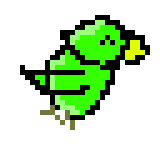

## Hi there 👋 I'm CodingBird874

(a Sea of C...++)

 My Favorite  Language is...  
 

  

Lanugages I've used so far...

      

## UPCOMING PROJECTS:

  
 The ollama based bot named Parrot.ai 

<!--
**CodeBird874/CodeBird874** is a ✨ _special_ ✨ repository because its `README.md` (this file) appears on your GitHub profile.

Here are some ideas to get you started:

-  🔭 I’m currently working on an ai bot (stay tuned..)
- 🌱 I’m currently learning ...
- 👯 I’m looking to collaborate on ...
- 🤔 I’m looking for help with ...
- 💬 Ask me about ...
- 📫 How to reach me: ...
- 😄 Pronouns: ...
- ⚡ Fun fact: ...
-->
